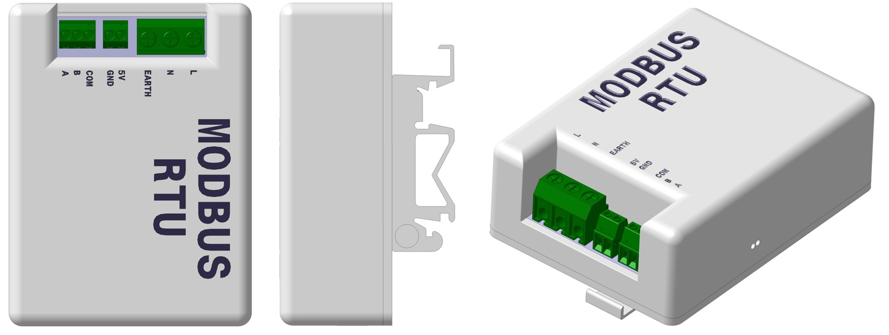
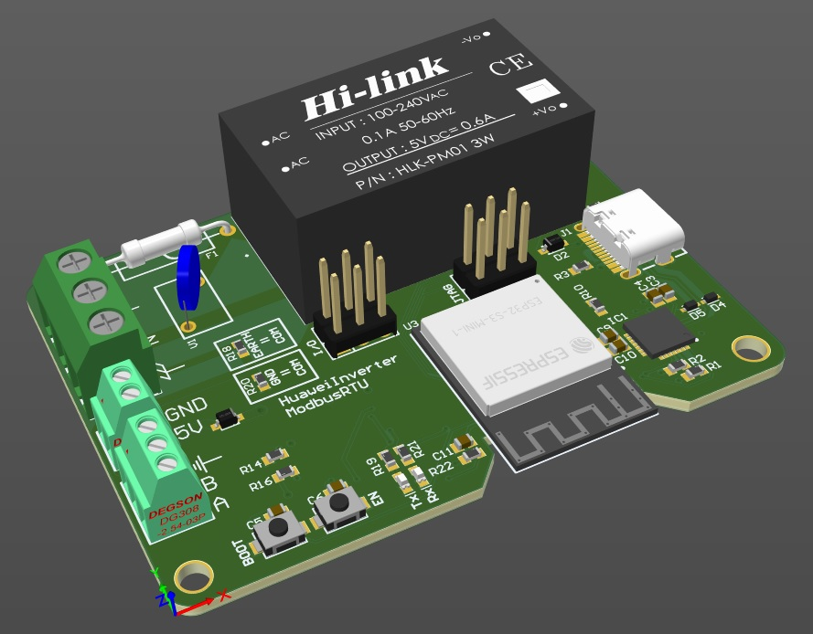
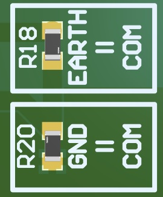
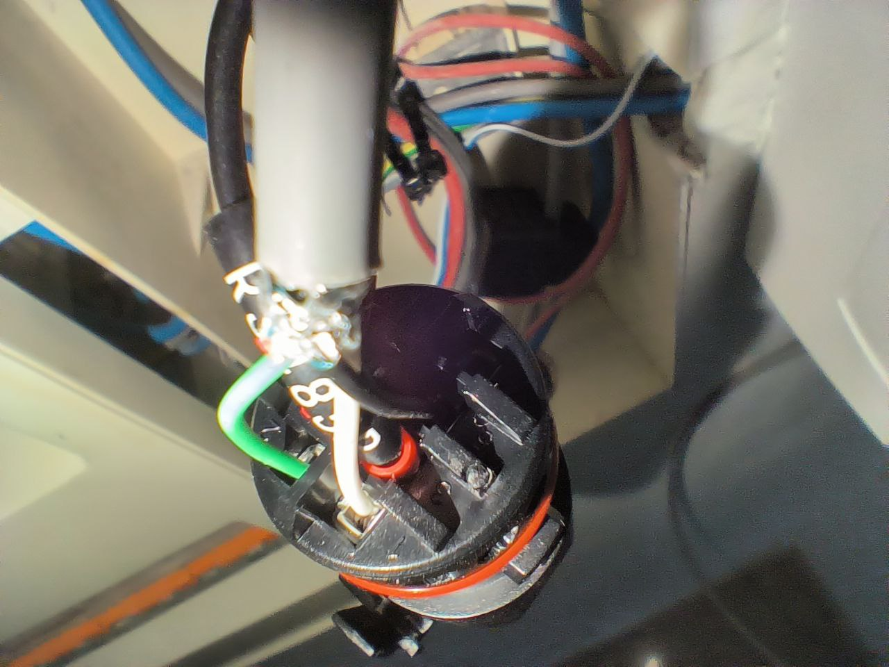
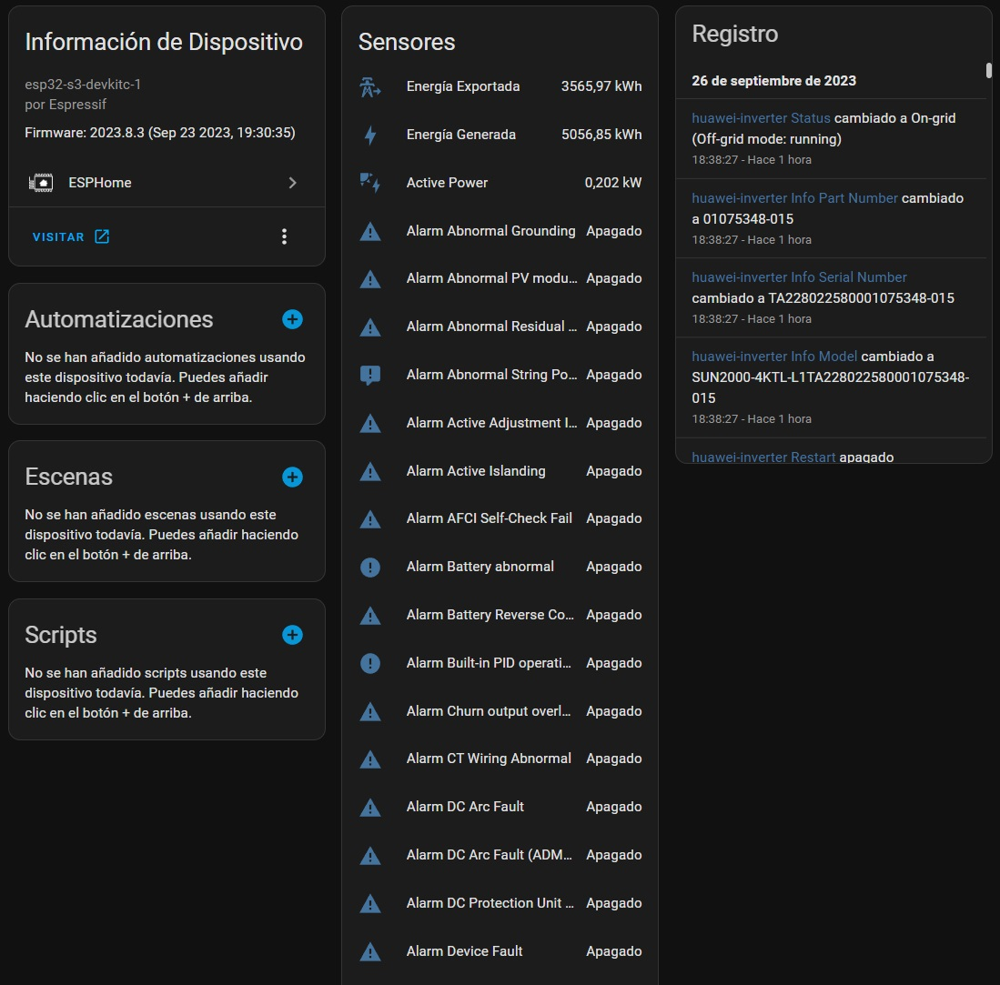
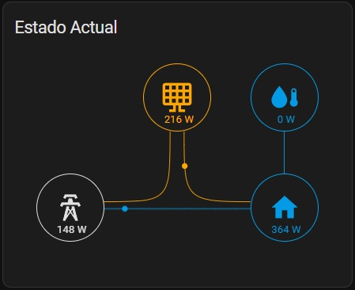

<a href='https://ko-fi.com/jcortizronda' target='_blank'>
[](https://www.paypal.me/jcortizronda/)

# huawei_modbusRTU
ModbusRTU Interface for Huawei Solar Inverters

This is a custom design of a pcb for MODBUS bus reading for Huawei inverters or similar. It includes an ESP32S3-MINI-N4 microcontroller and allows the reading of the RS485 bus thanks to an integrated converter. Unlike other existing integrations, this one allows you to have your inverter connected through ESPHome, fully configurable by the user.

I have hand-soldered my unit, so it's possible to do it!

The benefits of this integration are:
* Power the modbusRTU interface directly from your AC panel
* Calculating electricity cost and compensation for spanish billing system
* Translate fault and state codes to the corresponding strings
* Getting the home power and current consumptions
* Add a nice tesla-style-solar-power-card to your front-end
* Doing some basic monitoring of the solar yield of each of your strings (string ratio)
* Get notified when something goes wrong in your inverter



# PCB



Includes the following: 

* ESP32-S3mini N8
* RS485 to TTL Converter
* AC/DC Module
* AC Overvoltage and Overcurrent protection
* USB-C Programming Connector
* JTAG Connector
* Custom IO Connector

All files for manufacturing are included in pcb folder:
* [BOM-HuaweiInverterMODBUS](manufacturing/PCB/BOM-HuaweiInverterMODBUS.xlsx)
* [PickPlace-HuaweiInverterMODBUS](manufacturing/PCB/PickPlace-HuaweiInverterMODBUS.csv)
* [Gerbers&NCDrills](manufacturing/PCB/Gerbers&NCDrills.zip)

ATTENTION! The PCB has two jumper resistors to select the COM connection of the RS485 port (Ground or Earth). I recommend to solder [GND = COM].

SOLDER ONLY ONE




# Mounting

You will need the following elements:

1) PCB ModbusRTU Interface soldered
2) 3D Enclosure (modbusPCB_Part_A, modbusPCB_Part_B and din_clip)
3) 4x Screws M3x12 (for enclosure mounting)
4) 4x Screws M3x6 (for din clip mounting)

# Wiring

You have two options for powering ModbusRTU interface
* Connect L and N to your AC
* Connect 5V and GND to a 5V DC Adapter

Then, you must connect
1. Connect the A modbusRTU interface to your inverter's COM port (Pin 1)
2. Connect the A modbusRTU interface to your inverter's COM port (Pin 2)
3. Connect the GROUND modbusRTU interface to your interver's COM port (Pin 5)

 If using shielded cable, connect only one side to GROUND.

 Note: Inverter's COM port pin number are visible in the in the port itself.

WARNING: I recommend turning off the inverter through the switch, and the protections of the electrical panel that feed the inverter before making any connection.



# Setup
1. Config [huawei-inverter.yaml](scripts/huawei-inverter.yaml) with your parameters.
2. Connect USB-C to modbusRTU interface and flash the file.
3. Make the connections previously explained.
4. Connect ESPHome device to HomeAssistant and add ESPHome device.
Home Assistant should discover the new device.

### Configuration part in huawei-inverter.yaml
```yml
# Enable Home Assistant API
api:
  encryption:
    key: !secret huawei-inverter-encryption

ota:
  password: !secret huawei-inverter-ota

wifi:
  ssid: !secret wifi_ssid
  password: !secret wifi_password

  # Enable fallback hotspot (captive portal) in case wifi connection fails
  ap:
    ssid: "Huawei-Inverter Fallback Hotspot"
    password: !secret huawei-inverter-fallback
```

### HomeAssistant Card and information

You will get all the information that your inverter provides through the COM port, and you will be able to configure it to your liking.



You can use the [tesla-solar-card](https://github.com/reptilex/tesla-style-solar-power-card) to see in real time the energy flow of your home.



# Acknowledgments

Thanks to jesusrop for his work in his [repository](https://github.com/jesusrop/esphome_huawei_sun2000), on which I have based my work.


### Wanna a Plug&Play ModbusRTU Converter? Write me and I will do my best to send you one at the best price.